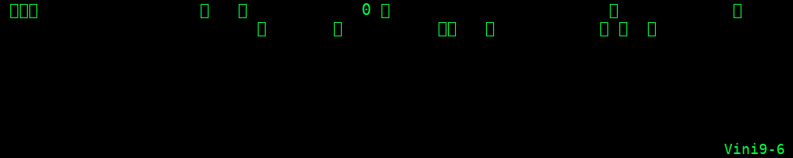

  

<h1 align="center">Vinícius Oliveira</h1>

  <b>code + hardware + AI</b>

  
  

---

### Sobre mim
Sou estudante de **Engenharia da Computação**.  
Gosto de programar, trabalhar com **hardware**, explorar **IA** e criar soluções práticas.  
Meus projetos vão desde **APIs em Java/Spring Boot** até **sistemas IoT com ESP32 e C++**.

---

### Tecnologias

---

### Stats

---

  "stay hungry, stay foolish!"  
   
  Vini9-6

